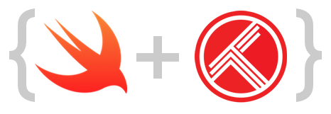

# AKTrakt

[](https://travis-ci.org/arsonik/AKTrakt)
[](http://cocoapods.org/pods/AKTrakt)
[](http://cocoapods.org/pods/AKTrakt)
[](http://cocoapods.org/pods/AKTrakt)
[](http://cocoadocs.org/docsets/AKTrakt/)
[](https://github.com/Carthage/Carthage)

AKTrakt is a trakt.tv client library written in Swift.

## Usage

To run the example project: clone the repo, execute `carthage update`, open AKTrakt.xcodeproj and build !

## Dependencies

- Alamofire

## Installation

AKTrakt is available through [CocoaPods](https://cocoapods.org/?q=AKTrakt). To install
it, simply add the following line to your Podfile:

```ruby
pod "AKTrakt"
```

## Screenshots


## Code

Feel free to fork, and add more features !

## Author

Florian Morello, arsonik@me.com

## License

AKTrakt is available under the MIT license. See the LICENSE file for more info.
